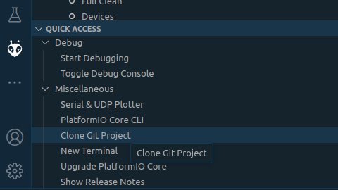
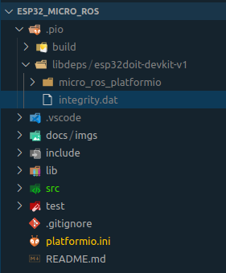

# ESP32_MICRO_ROS

## Description
Repository to learn to use plataformio_microros with the ESP32 DEV KIT miccrocontorller.

## Dependencies
### Software
* Operating system: [Ubuntu 22.04](https://ubuntu.com/tutorials/install-ubuntu-desktop#1-overview)
* Robotic Frameworks:
  * [ROS2 Humble (desktop)](https://docs.ros.org/en/humble/Installation/Ubuntu-Install-Debians.html)
  * [Vulcanexus (base)](https://docs.vulcanexus.org/en/humble/rst/installation/linux_binary_installation.html)
* Microcontroller Framework: [Micro-ROS](https://micro.ros.org)
* IDE: [PlatfotmIO on Visual Studio Code](https://platformio.org/install/ide?install=vscode)

#### PlatfotmIO
* [micro-ROS library](https://github.com/micro-ROS/micro_ros_platformio)

### Hardware
* Microcontroller: [ESP32 DEV KIT](https://www.espressif.com/en/products/devkits/esp32-devkitc)

## Install
```
sudo apt-get install python3-venv
```
install the repository as a platformIO project:

<p align="left">
  
</p>

*Note*: if the micro_ros_platformio doesn't install, comment any ROS pkg source in your .bashrc, like this:
```
# Setup ROS2
#source /opt/ros/humble/setup.bash
#source /opt/vulcanexus/humble/setup.bash
```
Delet the /.pio/libdeps/esp32doit-devkit-v1/micro_ros_platformio folder and restart the computer.

<p align="left">
  
</p>

Open the proyect with VSC again, the microros_ros_platformio should install correctly.

## Knowledge base tutorials
* [Linux course for robotic](https://app.theconstructsim.com/courses/linux-for-robotics-40/)
* [Basic C++ for robotic](https://app.theconstructsim.com/courses/59)
* [Beginner ROS2 tutorials](https://docs.ros.org/en/humble/Tutorials/Beginner-CLI-Tools.html)
* [Getting started micro-ROS](https://micro.ros.org/docs/tutorials/programming_rcl_rclc/overview/)

One you are ready with the turorials check the example of[esp32 microros github](https://github.com/MonkyDCristian/esp32_micro_ros).

## Compile and upload config
Go to your platformio.ini file to set the build_src_filter.

Give write access to the ESP32 port with:
```
sudo chmod a+wr /dev/ttyUSB0
```
or
```
sudo chmod a+wr /dev/ttyACM0
```

Go to your platformio.ini file to set the build_src_filter.

### To test the microros agent by USB
```
build_src_filter = +<examples/test_by_usb/*> -<.git/> -<.svn/>
```
Now compile and upload to the ESP32.

### For the ESP32 of the left motor
```
build_src_filter = +<examples/left_motor/*> -<.git/> -<.svn/>
```
Now compile and upload to the ESP32.


### For the ESP32 of the right motor
```
build_src_filter = +<examples/right_motor/*> -<.git/> -<.svn/>
```
Now compile and upload to the ESP32.

## Connect one ESP32 motor by RS48
Find the serial [device name]:
```---
ls /dev/serial/by-id/*
```
Add access to USB port
```
sudo chmod a+wr [device name]
```
Start micro_ros_agent:
```
ros2 run micro_ros_agent micro_ros_agent serial --dev [device name]
```

## Connect both motors, left and right, at the same time by RS48 (Fast way)
restart both ESP32, from now you have 5 second to launch this commands
```
sudo chmod a+wr /dev/ttyUSB0 /dev/ttyUSB1
ros2 launch caleuche_task_0 microros_torqueedo_bringup.launch.py
```

**Note:** source the caleuche_ws in your ~/.bashrc befor run it.

## Topics

### Subscribers
#### Command velocity
**Name**: /wamv_caleuche/thrusters/{side}/cmd_vel

**Type**: std_msgs, msg, Bool

**Description**: resive an int value between -1000 and 1000 that set the motor velocity.

```
ros2 topic pub --once /wamv_caleuche/thrusters/right/cmd_vel std_msgs/msg/Int16 data:\ 100\
```

#### Turn ON/OFF
**Name**: /wamv_caleuche/thrusters/{side}/turn_on_off

**Type**:std_msgs, msg, Int16

**Description**: if true, turn on the torqeedo motor, false, turn off.

```
ros2 topic pub --once /wamv_caleuche/thrusters/right/turn_on_off std_msgs/msg/Bool data:\ true\
```

### Note:In the names of the topics side = right or left. The turn ON/OFF is the same for both motor.
 
